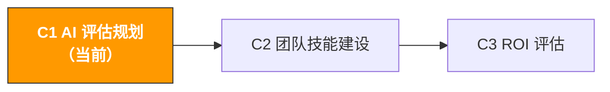

# C1. AI 能力评估与规划 | AI Capability Assessment & Planning

> **路径**: Path C: 管理者 · **模块**: C1
> **最后更新**: 2026-03-12
> **难度**: 入门
> **预计时间**: 1-2 小时




---

## 本模块章节导航

1. [AI 落地方法论](#1-ai-落地方法论先想清楚再动手) · 2. [优先级矩阵](#2-ai-落地优先级矩阵) · 3. [Prompt 模板](#3-prompt-模板管理者专用) · 4. [评估工具](#4-评估工具) · 5. [实战工作流](#5-实战工作流ai-落地规划-sop) · 6. [常见陷阱](#6-常见陷阱) · 7. [案例分析](#7-案例分析不同规模团队的-ai-落地) · 8. [学习资源](#8-学习资源)

---

## 本模块你将产出

一份团队 AI 能力评估报告和优先级排序方案。完成后你将拥有：
- 一份团队 AI 成熟度评估结果（10 个维度打分）
- 一张 AI 落地优先级矩阵（15+ 运营环节的评估）
- 一份 AI 落地规划书（含阶段目标、时间线、预算估算）
- 一套变革管理方案（让团队真正用起来，而不是"买了不用"）

> **核心理念**：AI 落地不是技术问题，是管理问题。


---

## 1. AI 落地方法论：先想清楚再动手

> **相关阅读**: [AI 应用全景评估](../0-foundations/ai-landscape.md) 各环节 AI 成熟度详见 AI 全景 · [平台全景对比](../d-platforms/platform-comparison.md) 各平台 AI 应用成熟度和优先级排序详见平台全景对比。

### 1.1 AI 不是万能的

**AI 擅长的任务特征：**

| 特征 | 说明 | 跨境电商示例 |
|------|------|-------------|
| 重复性高 | 每天/每周都要做的标准化工作 | 搜索词报告分析、Review 监控、库存预警 |
| 信息密集 | 需要处理大量文本或数据 | 竞品 Review 分析、关键词聚类、市场调研 |
| 模式识别 | 从数据中发现规律和异常 | 广告效果异常检测、退货原因归类、价格趋势 |
| 内容生成 | 需要产出文字、翻译、改写 | Listing 文案、客服回复模板、广告文案变体 |
| 结构化分析 | 按固定框架做多维度评估 | 选品可行性评估、供应商对比、ROI 计算 |

**AI 不擅长的任务特征：**

| 特征 | 说明 | 跨境电商示例 |
|------|------|-------------|
| 需要实时数据 | AI 不知道"现在"的数据 | 当前 BSR 排名、实时库存、今天的 CPC |
| 需要人际判断 | 涉及关系、信任、谈判 | 供应商谈判、客户关系维护、团队管理 |
| 需要创造性决策 | 真正的创新来自跨界灵感 | 蓝海品类发现、品牌定位、差异化策略 |
| 需要物理验证 | 必须亲眼看、亲手摸 | 产品品控、工厂验厂、包装设计打样 |
| 高风险决策 | 错误代价很大的决策 | 大额采购、市场进入/退出、法律合规 |
| 需要最新政策 | 平台规则经常变化 | Amazon 最新政策解读、合规要求变更 |

> **判断标准**：如果一个任务可以写成 SOP，那它大概率可以用 AI 提效。

### 1.2 AI 落地的三个阶段

| 维度 | 试点期（1-2月） | 规模化（3-6月） | 系统化（6-12月） |
|------|--------|--------|--------|
| 目标 | 验证 1-2 个场景效果 | 推广到全团队 | AI 融入业务流程 |
| 投入 | 1-2 人 × 每天 30 分钟 | 全团队 × 每天 15-30 分钟 | 专人维护 |
| 工具 | ChatGPT/Claude 免费版 | 付费 AI + Prompt 库 | API 集成 + Agent |
| 成功标准 | 1 个场景效率提升 50%+ | 80%+ 的人每天用 AI | 关键流程自动化 >60% |
| 管理重点 | 选对场景和人 | 培训和标准化 | 流程优化和自动化 |
| 最大风险 | 选错场景 | 团队抵触 | 过度依赖 |
| 预算 | $20-50/月 | 培训时间 + 工具升级 | 开发集成 + 专人维护 |
| 成功关键 | AI Champion 的热情 | 管理者的推动力 | 技术团队的执行力 |

### 1.3 常见失败原因

| 失败原因 | 具体表现 | 如何避免 |
|----------|----------|----------|
| **期望过高** | "AI 应该能自动写出完美的 Listing" → 放弃 | 设定合理预期：AI 提效 50-80%，不是 100% 替代 |
| **没有 Champion** | 管理者说"大家去用 AI"，但没人带头 | 指定 1-2 个 AI Champion，给他们时间和资源 |
| **工具太多** | 同时引入 5 个 AI 工具 → 都不用 | 一次只引入一个工具，用熟了再加 |
| **忽略培训** | 买了工具但不教怎么用 → "AI 没用" | 至少安排 2 小时的 Prompt 工程培训 |
| **没有衡量** | 不知道 AI 到底省了多少时间 | 从第一天就记录时间对比（参考 [C3](c3-roi-evaluation.md)） |
| **一步到位** | 直接跳到系统化阶段 → 浪费 | 严格按三个阶段走 |
| **忽略数据安全** | 把敏感数据直接粘贴到 ChatGPT | 制定 AI 使用规范 |

Content rephrased for compliance with licensing restrictions. Source: [McKinsey Global Survey on AI](https://www.mckinsey.com/capabilities/quantumblack/our-insights/the-state-of-ai)


---

## 2. AI 落地优先级矩阵

**优先级计算公式：** `优先级得分 = (AI 提效潜力 × 业务影响) / 实施难度`

| # | 运营环节 | AI 提效潜力 | 实施难度 | 业务影响 | 优先级得分 | 推荐阶段 | 推荐工具 |
|---|----------|------------|----------|----------|-----------|----------|----------|
| 1 | Listing 文案撰写 | 5 | 1 | 5 | **25.0** | 试点期 | ChatGPT/Claude |
| 2 | 竞品 Review 分析 | 5 | 1 | 4 | **20.0** | 试点期 | ChatGPT/Claude |
| 3 | 多语言翻译/本地化 | 5 | 1 | 4 | **20.0** | 试点期 | ChatGPT/DeepL |
| 4 | 搜索词报告分析 | 5 | 2 | 5 | **12.5** | 试点期 | ChatGPT + 数据导出 |
| 5 | 客服回复模板 | 4 | 1 | 3 | **12.0** | 试点期 | ChatGPT/Claude |
| 6 | 广告文案 A/B 测试 | 4 | 1 | 3 | **12.0** | 试点期 | ChatGPT/Claude |
| 7 | 选品市场评估 | 4 | 2 | 5 | **10.0** | 试点期 | ChatGPT + 数据工具 |
| 8 | 关键词研究 | 4 | 2 | 4 | **8.0** | 试点期 | ChatGPT + Helium 10 |
| 9 | 库存需求预测 | 4 | 3 | 5 | **6.7** | 规模化 | Python + AI 模型 |
| 10 | 合规文档准备 | 3 | 2 | 4 | **6.0** | 规模化 | ChatGPT + 合规数据库 |
| 11 | 广告自动竞价 | 4 | 3 | 4 | **5.3** | 规模化 | Adtomic/Perpetua |
| 12 | 全链路数据分析 | 5 | 5 | 5 | **5.0** | 系统化 | BI + AI 集成 |
| 13 | 自动化报表生成 | 4 | 3 | 3 | **4.0** | 系统化 | Python + API |
| 14 | 竞品价格监控 | 3 | 3 | 3 | **3.0** | 规模化 | Keepa + 自动化脚本 |
| 15 | 供应链风险预警 | 3 | 4 | 4 | **3.0** | 系统化 | 定制开发 |
| 16 | 智能客服 Bot | 4 | 4 | 3 | **3.0** | 系统化 | 定制 Agent |

**如何使用：** 和团队讨论每个环节的评分是否符合实际情况 → 调整评分 → 选优先级最高的 2-3 个作为试点 → 用第 3 节的 Prompt 模板生成落地计划。

> **常见误区**：不要选优先级最高但团队最抵触的环节。试点的目的是"让团队看到效果"。


---

## 3. Prompt 模板（管理者专用）

### 3.1 团队 AI 落地规划生成

```
你是一个跨境电商 AI 落地顾问。请基于以下信息，为我的团队制定 AI 落地规划：

团队信息：
- 团队规模：[X] 人
- 主要业务：跨境电商 [Amazon/独立站/多平台]
- 运营市场：[US/EU/JP/多站点]
- 当前使用的工具：[列出主要工具]
- 团队 AI 使用现状：[没人用/少数人在用/大部分人在用]
- 最大的效率瓶颈：[描述 2-3 个最耗时的工作]
- 月度 AI 工具预算：[X] 元/美元

请输出：
**阶段一：试点期（第 1-2 个月）** 推荐试点场景、工具、负责人职责、第一周行动清单、衡量标准
**阶段二：规模化（第 3-6 个月）** 扩展路径、标准化流程、培训计划、新增工具、KPI
**阶段三：系统化（第 7-12 个月）** 自动化集成、技术支持需求、长期架构、预期 ROI
每个阶段标注：预算估算、风险提示、关键里程碑。
```

### 3.2 AI 工具预算规划

```
你是一个跨境电商 AI 工具采购顾问。请帮我做 AI 工具预算规划：

团队信息：
- 团队规模：[X] 人
- 月度总预算上限：[X] 元/美元
- 当前已有工具：[列出]
- 最需要 AI 提效的环节：[列出 3-5 个]

请输出：
1. 推荐工具组合（按优先级排序，含月费用、解决什么问题、预计节省时间）
2. 三档预算方案（最低/推荐/充足）
3. ROI 预估（每个工具的时间节省 × 时薪）
4. 采购建议（先买什么、免费替代、年付 vs 月付）
```

### 3.3 AI 能力差距分析

```
你是一个团队 AI 能力评估专家。请基于以下信息分析我团队的 AI 能力差距：

团队现状：
- 团队成员及其角色：[如：运营 3 人、广告 2 人、客服 2 人]
- 各角色当前的 AI 使用情况：[描述]
- 团队整体技术水平：[基础/中等/较强]
- 希望 [X] 个月后达到的 AI 使用水平：[描述]

请输出：
1. 能力差距地图（角色 | 当前能力 | 目标能力 | 差距 | 优先级）
2. 关键差距分析（最大的 3 个差距、根本原因、弥补资源和时间）
3. 培训计划建议（全员必修 + 按角色专项 + 推荐形式和频率）
```

### 3.4 变革管理方案

```
你是一个组织变革管理专家，专注于 AI 落地的变革管理。

我的团队情况：
- 团队规模：[X] 人
- 团队对 AI 的态度：[积极/中立/抵触/混合]
- 主要顾虑：[如"担心被替代"、"觉得学不会"、"觉得没必要"]
- 管理层支持度：[强/中/弱]

请设计一套变革管理方案：
1. 沟通策略（目的传达、第一次会议议程、处理焦虑）
2. Champion 机制（选拔标准、职责权限、激励方式）
3. 渐进式推广（第 1 周演示 → 第 2-4 周试用 → 第 2-3 月习惯 → 第 4-6 月依赖）
4. 激励机制（短期/中期/长期）
5. 阻力处理（常见阻力类型和应对话术）
```


---

## 4. 评估工具

### 4.1 AI 成熟度评估问卷（10 个问题）

**评分标准：** 1 = 完全不符合，5 = 完全符合

| # | 评估维度 | 问题 |
|---|----------|------|
| 1 | AI 认知 | 我了解 AI 能做什么、不能做什么 |
| 2 | 工具使用 | 我每周至少使用一次 AI 工具辅助工作 |
| 3 | Prompt 能力 | 我能写出结构化的 Prompt |
| 4 | 场景识别 | 我能识别工作中哪些环节适合用 AI |
| 5 | 质量判断 | 我能判断 AI 输出的内容质量 |
| 6 | 数据意识 | 我知道哪些数据可以给 AI，哪些不能 |
| 7 | 效率提升 | AI 已经帮我节省了明显的时间 |
| 8 | 持续学习 | 我会主动关注 AI 工具的新功能 |
| 9 | 知识分享 | 我会把好用的 Prompt 分享给同事 |
| 10 | 流程整合 | AI 已经成为我某些工作流程的固定环节 |

**评分解读：**

| 平均分 | 成熟度等级 | 建议行动 |
|--------|-----------|----------|
| 1.0-2.0 | 初始级 | 从 AI 认知培训开始，选 1 个最简单的场景试点 |
| 2.1-3.0 | 探索级 | 找到 Champion，建立 Prompt 库，扩大试点范围 |
| 3.1-4.0 | 应用级 | 标准化流程，深化使用场景，开始衡量 ROI |
| 4.1-5.0 | 优化级 | 探索自动化集成，建立 AI 驱动的新流程 |

### 4.2 团队 AI 技能评估表

**运营岗：**

| 技能项 | 初级 | 中级 | 高级 |
|--------|------|------|------|
| 用 AI 写 Listing | 能生成基础文案 | 多语言 + SEO 优化 | A/B 测试迭代 |
| 用 AI 分析 Review | 能让 AI 总结 | 结构化痛点分析 | 多竞品对比趋势 |
| 用 AI 做选品 | 评估单个产品 | 多产品横向对比 | 完整 AI 辅助选品 SOP |
| 用 AI 处理多语言 | 基础翻译 | 本地化适配 | 文化差异分析 |

**广告岗：**

| 技能项 | 初级 | 中级 | 高级 |
|--------|------|------|------|
| 搜索词分析 | 粘贴数据让 AI 分析 | 分层分析和趋势对比 | 自动化分析流程 |
| 广告文案 | 生成基础 Headline | 多风格 A/B 测试 | SB Video 脚本 |
| 预算优化 | AI 建议预算分配 | 大促预算策略 | 多站点预算优化 |

**客服岗：**

| 技能项 | 初级 | 中级 | 高级 |
|--------|------|------|------|
| 回复生成 | 基础回复 | 多场景多种回复 | 完整回复模板库 |
| 反馈分析 | AI 总结反馈 | 分类和趋势分析 | 根因分析和改进建议 |
| 多语言客服 | 基础翻译回复 | 语气和文化适配 | 多语言客服 SOP |


---

## 5. 实战工作流：AI 落地规划 SOP

**2 周内从"想用 AI"到"开始用 AI"：**

| 时间 | 操作 | AI 辅助 | 输出 |
|------|------|---------|------|
| Day 1-2 | 全员填写成熟度问卷（4.1）+ 技能评估表（4.2） | 用 Prompt 3.3 汇总结果 | 团队 AI 成熟度基线报告 |
| Day 3-4 | 团队讨论优先级矩阵（第 2 节），调整评分 | 用 Prompt 3.1 生成初步计划 | 确定 2 个试点场景 + 试点负责人 |
| Day 5-7 | 评估试点场景需要的 AI 工具 | 用 Prompt 3.2 做成本分析 | 工具采购清单 + 预算审批 |
| Day 8-10 | 确定 AI Champion，准备团队沟通 | 用 Prompt 3.4 设计推广策略 | 团队沟通计划 + Champion 职责说明 |
| Day 11-14 | 召开团队启动会，开始试点 | 演示 AI 效果 → 分发工具账号 → 分享 Prompt 模板 | 试点正式启动 |

**试点期执行指南（第 1-2 个月）：**

- 第 1 周：AI Champion 准备一个真实场景（如分析 50 条竞品差评），先手动做一遍记录时间，再用 AI 做一遍，在团队会议上演示对比
- 第 2-4 周：每人分配一个简单 AI 任务 + 提供 Prompt 模板 + Champion 每天 15 分钟答疑 + 每周五 15 分钟分享会
- 第 5-8 周：AI 使用融入现有工作流程 + 建立团队 Prompt 库 + 开始记录时间节省数据

---

## 6. 常见陷阱

| 类别 | 陷阱 | 如何避免 |
|------|------|----------|
| 期望管理 | 期望过高 → 全面否定 AI | 设定具体可衡量的目标 |
| 期望管理 | 期望过低 → 只用最基础功能 | 定期分享 AI 新用法和成功案例 |
| 期望管理 | 急于求成 → 试点没完成就否定 | AI 落地需要 2-3 个月才能看到稳定效果 |
| 人员管理 | 没有 Champion → 工具买了没人用 | 选一个对 AI 有热情的人，给 20% 工作时间 |
| 人员管理 | Champion 孤军奋战 | 管理者公开支持，给 Champion 展示时间 |
| 人员管理 | 忽略抵触情绪 → 表面配合实际不用 | 正面回应"AI 会取代我吗"的问题 |
| 人员管理 | 不给学习时间 → 没人有时间学 | 每周给 2-3 小时"AI 学习时间" |
| 工具管理 | 工具太多 → 不知道用哪个 | 一次只引入一个工具 |
| 工具管理 | 只买不用 → 浪费预算 | 每月检查使用率，低于 50% 考虑退订 |
| 工具管理 | 数据安全盲区 | 制定明确的数据分类标准 |
| 流程管理 | 没有 SOP → 质量参差不齐 | 建立标准化 Prompt 库和使用流程 |
| 流程管理 | 过度依赖 → 出现错误 | AI 输出必须经过人工审核 |


---

## 7. 案例分析：不同规模团队的 AI 落地

### 7.1 案例一：5 人团队（小型卖家）

| 阶段 | 时间 | 行动 | 工具 | 月成本 |
|------|------|------|------|--------|
| 试点 | 第 1-2 月 | 老板做 Champion，Listing + Review 分析试点 | ChatGPT 免费版 | $0 |
| 规模化 | 第 3-4 月 | 全员使用，建立 5 个核心 Prompt 模板 | ChatGPT Plus × 2 | $40 |
| 深化 | 第 5-6 月 | 广告搜索词分析 + 客服回复模板 | ChatGPT Plus × 2 | $40 |

6 个月后：AI 成熟度 1.5→2.8，Listing 省 62%，Review 分析省 89%，月成本 $40，月省约 60 小时。

### 7.2 案例二：20 人团队（中型卖家）

| 阶段 | 时间 | 行动 | 工具 | 月成本 |
|------|------|------|------|--------|
| 试点 | 第 1-2 月 | 2 个 Champion（运营+广告），Review + 搜索词分析 | ChatGPT Plus × 3 | $60 |
| 规模化 | 第 3-4 月 | 团队 Prompt 库 20+ 模板，全员培训，AI 使用规范 | ChatGPT Team × 10 | $250 |
| 系统化 | 第 5-8 月 | 引入 Adtomic，探索 API 集成 | ChatGPT Team + Adtomic | $500 |

8 个月后：AI 成熟度 2.3→3.5，Prompt 库 35 模板，ACOS 降 8%，运营效率提升 35%，月成本 $500，月省约 300 小时。

### 7.3 案例三：50 人团队（大型卖家/品牌方）

| 阶段 | 时间 | 行动 | 工具 | 月成本 |
|------|------|------|------|--------|
| 试点 | 第 1-2 月 | 每部门 1 个 Champion（共 5 个） | ChatGPT Team × 10 | $250 |
| 规模化 | 第 3-6 月 | 全员培训，公司级 Prompt 库，AI 治理框架 | ChatGPT Team × 30 + Claude × 5 | $900 |
| 系统化 | 第 7-12 月 | 内部 AI 工具平台，API 集成，自动化工作流 | 企业级工具 + 定制开发 | $2000+ |

12 个月后：AI 成熟度 2.5→3.8，Prompt 库 80+ 模板，3 个自动化工作流上线，运营效率提升 45%。

### 7.4 三种规模对比

| 维度 | 5 人 | 20 人 | 50 人 |
|------|------|-------|-------|
| 达到应用级时间 | 4-6 月 | 6-8 月 | 8-12 月 |
| Champion 数量 | 1（老板） | 2-3 | 5+ |
| 是否需要 Prompt 库 | 可选 | 必须 | 必须 |
| 是否需要 AI 治理 | 不需要 | 基础版 | 完整版 |
| 月度工具成本 | $0-40 | $60-500 | $250-2000+ |

> 团队越大，AI 落地越需要"管理"而不是"技术"。


---

## 8. 学习资源

### 8.1 AI 战略与管理

| 资源 | 来源 | 链接 |
|------|------|------|
| The State of AI | McKinsey | [mckinsey.com](https://www.mckinsey.com/capabilities/quantumblack/our-insights/the-state-of-ai) |
| AI Transformation Playbook | Andrew Ng | [landing.ai](https://landing.ai/resources/) |
| Generative AI for CEOs | BCG | [bcg.com](https://www.bcg.com/capabilities/artificial-intelligence) |

### 8.2 Prompt 工程基础

| 资源 | 平台 | 链接 |
|------|------|------|
| ChatGPT Prompt Engineering | DeepLearning.AI | [deeplearning.ai](https://www.deeplearning.ai/short-courses/chatgpt-prompt-engineering-for-developers/) |
| OpenAI Prompt Engineering Guide | OpenAI | [platform.openai.com](https://platform.openai.com/docs/guides/prompt-engineering) |
| Anthropic Prompt Engineering Guide | Anthropic | [docs.anthropic.com](https://docs.anthropic.com/en/docs/build-with-claude/prompt-engineering) |

### 8.3 推荐书籍

| 书名 | 作者 | 为什么推荐 |
|------|------|-----------|
| 《AI Superpowers》 | 李开复 | 理解 AI 全球格局和商业影响 |
| 《The AI-First Company》 | Ash Fontana | 如何让 AI 成为核心竞争力 |
| 《Prediction Machines》 | Ajay Agrawal 等 | 用经济学框架理解 AI 价值 |
| 《Co-Intelligence》 | Ethan Mollick | 如何与 AI 协作而非被替代 |

Content rephrased for compliance with licensing restrictions. Sources cited inline.

## 10. 完成标志

- [ ] 完成团队 AI 成熟度评估问卷（全员填写，汇总平均分）
- [ ] 完成 AI 落地优先级矩阵（根据团队实际情况调整评分）
- [ ] 确定 2 个试点场景和 AI Champion
- [ ] 用 Prompt 模板生成一份 AI 落地规划书（含三个阶段）
- [ ] 完成 AI 工具预算规划（含 ROI 预估）
- [ ] 制定 AI 使用规范（数据安全、审核流程）
- [ ] 召开团队 AI 启动会，正式开始试点

---

## 附录：快速参考卡片

### Prompt 速查表

| 场景 | Prompt 模板 | 所在章节 |
|------|------------|---------|
| 制定 AI 落地计划 | 团队 AI 落地规划生成 | [3.1](#31-团队-ai-落地规划生成) |
| AI 工具预算规划 | AI 工具预算规划 | [3.2](#32-ai-工具预算规划) |
| 团队能力差距分析 | AI 能力差距分析 | [3.3](#33-ai-能力差距分析) |
| 变革管理方案 | 变革管理方案 | [3.4](#34-变革管理方案) |

### AI 落地阶段速查

| 阶段 | 目标 | 时间 | 关键动作 | 成功标准 |
|------|------|------|----------|----------|
| 试点期 | 验证效果 | 1-2 月 | 选场景、选 Champion、做演示 | 1 个场景效率提升 50%+ |
| 规模化 | 全员使用 | 3-6 月 | 建 Prompt 库、做培训、定规范 | 80%+ 的人每天用 AI |
| 系统化 | 融入流程 | 6-12 月 | API 集成、自动化、持续优化 | 关键流程自动化 >60% |

(README.md) | [C2 团队 >](c2-team-building.md)
