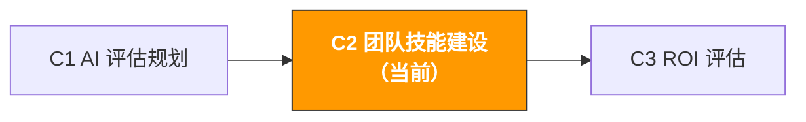

# C2. 团队 AI 技能建设 | AI Team Upskilling & Enablement

> **路径**: Path C: 管理者 · **模块**: C2
> **最后更新**: 2026-03-12
> **难度**: 入门
> **预计时间**: 1-2 小时
> **前置模块**: [C1 AI 能力评估与规划](c1-ai-assessment.md)
---




---

## 本模块章节导航

1. [培训方法论](#1-培训方法论为什么大多数-ai-培训都失败了) · 2. [按角色培训](#2-按角色定制的培训课程) · 3. [Prompt 库搭建](#3-团队-prompt-库搭建) · 4. [使用规范](#4-ai-使用规范制定) · 5. [Prompt 模板](#5-prompt-模板团队建设专用) · 6. [实战工作流](#6-实战工作流从零搭建团队-ai-能力) · 7. [常见问题](#7-常见问题与解决方案) · 8. [案例分析](#8-案例分析团队-ai-技能建设实战) · 9. [学习资源](#9-学习资源)


## 本模块你将产出

一套可执行的团队 AI 技能建设方案。

完成本模块后，你将拥有：

- 一份按角色定制的 AI 培训课程表（运营/广告/客服各不同）
- 一套团队 Prompt 库搭建方案（从 0 到 50+ 模板）
- 一份 AI 使用规范文档（数据安全、审核流程、工具管理）
- 一套持续学习机制（让团队不只是"学了一次"，而是"每天在用"）

> **核心理念**：培训不是目的，行为改变才是。一次 2 小时的 workshop 不会改变任何事。真正有效的是"每天 15 分钟的刻意练习 + 每周的分享复盘"。

---

## 1. 培训方法论：为什么大多数 AI 培训都失败了

> **相关阅读**: [F2 Prompt 工程](../0-foundations/f2-prompt-engineering.md) 团队 Prompt 工程培训内容详见 F2。 · [A2 Listing 与内容创作](../a-operators/a2-listing-optimization.md) Listing AI 工作流示例详见 A2

### 1.1 传统培训的三大问题

根据 PwC 的调查，67% 的员工认为自己没有准备好使用 AI 技术。但问题不在于缺少培训，而在于培训方式错了。

| 问题 | 表现 | 根本原因 |
|------|------|----------|
| **一次性培训** | 办了一次 2 小时的 workshop，然后就没有然后了 | 技能需要重复练习才能内化，一次培训的知识留存率不到 20% |
| **脱离业务** | 培训内容是"AI 的原理和历史"，和日常工作无关 | 成年人学习的动力来自"解决当前的问题"，不是"了解新知识" |
| **一刀切** | 运营、广告、客服用同一套培训内容 | 不同岗位的 AI 使用场景完全不同，通用培训对谁都没用 |

Content rephrased for compliance with licensing restrictions. Source: [PwC Global AI Study](https://www.pwc.com/gx/en/issues/data-and-analytics/publications/artificial-intelligence-study.html)

### 1.2 有效的 AI 培训框架：70-20-10 法则

借鉴成人学习理论的 70-20-10 法则，有效的 AI 技能建设应该是：

```
70% 在工作中学习（Learning by Doing）
每天用 AI 完成一个真实工作任务
从 Prompt 库中选一个模板，用在自己的业务上
记录"AI 前"和"AI 后"的时间对比

20% 从同事中学习（Learning from Others）
每周 15 分钟的"AI 使用分享"（每人分享一个技巧）
AI Champion 每天花 15 分钟回答团队问题
建立团队 Prompt 库，互相贡献和改进

10% 正式培训（Formal Training）
入职培训：2 小时 AI 基础 + Prompt 工程
月度培训：1 小时新功能/新技巧
按角色专项培训：深度使用场景
```

> **关键洞察**：大多数公司把 90% 的精力放在"正式培训"上，但它只贡献 10% 的学习效果。真正的技能提升来自"每天在工作中用"。

### 1.3 AI 技能建设的四个阶段

```
阶段一：认知（第 1 周）
目标：团队理解 AI 能做什么、不能做什么
方法：一次 2 小时的 workshop + 现场演示
产出：每个人写出"我的工作中哪 3 个环节可以用 AI"
成功标准：100% 的人能说出至少 1 个 AI 使用场景

阶段二：模仿（第 2-4 周）
目标：团队能用现成的 Prompt 模板完成任务
方法：分发 Prompt 库 + 每天一个练习任务
产出：每个人至少用 5 个不同的 Prompt 模板
成功标准：80% 的人每周至少用 3 次 AI

阶段三：创造（第 2-3 月）
目标：团队能自己写 Prompt、改进 Prompt
方法：Prompt 工程进阶培训 + 团队 Prompt 库贡献
产出：每个人贡献至少 2 个自创 Prompt 到团队库
成功标准：团队 Prompt 库达到 30+ 模板

阶段四：优化（第 4-6 月）
目标：AI 成为日常工作流程的一部分
方法：流程优化 + ROI 衡量 + 持续迭代
产出：至少 3 个工作流程正式纳入 AI 辅助
成功标准：团队 AI 成熟度评分提升 1.0+ 分
```

Content rephrased for compliance with licensing restrictions. Source: [Amplework AI Adoption Guide](https://www.amplework.com/blog/train-your-team-for-ai-adoption/)

---

## 2. 按角色定制的培训课程

### 2.1 全员必修课：AI 基础与 Prompt 工程（2 小时）

这是所有人都要上的第一课。目标不是让大家成为 AI 专家，而是消除恐惧、建立信心。

**课程大纲：**

| 时间 | 内容 | 形式 | 目标 |
|------|------|------|------|
| 0:00-0:20 | AI 能做什么、不能做什么 | 讲解 + 演示 | 建立合理预期 |
| 0:20-0:40 | 现场演示：用 AI 分析 50 条竞品差评 | 现场操作 | 让团队"看到"效果 |
| 0:40-1:00 | Prompt 工程基础：好 Prompt 的 5 个要素 | 讲解 + 示例 | 理解 Prompt 结构 |
| 1:00-1:30 | 动手练习：每人用 Prompt 模板完成一个任务 | 实操 | 从"看"到"做" |
| 1:30-1:50 | 分享和讨论：每人展示自己的结果 | 小组分享 | 互相学习 |
| 1:50-2:00 | 下一步：本周的 AI 练习任务 | 布置作业 | 延续学习 |

**好 Prompt 的 5 个要素（CRISP 框架）：**

```
C Context（上下文）：告诉 AI 你是谁、在做什么
R Role（角色）：给 AI 一个专家角色
I Instruction（指令）：明确告诉 AI 要做什么
S Specifics（细节）：提供具体的数据、约束、格式要求
P Product（产出）：描述你期望的输出格式
```

**示例对比：**

差的 Prompt：
```
帮我分析一下这个产品的市场
```

好的 Prompt（使用 CRISP 框架）：
```
[Context] 我是一个 Amazon US 站的运营，正在评估是否进入便携风扇品类。
[Role] 你是一个资深的跨境电商选品顾问。
[Instruction] 请从以下 5 个维度评估这个品类的市场可行性。
[Specifics] 评估维度：市场需求（1-5分）、竞争强度（1-5分）、利润空间（1-5分）、供应链难度（1-5分）、合规风险（1-5分）。
[Product] 输出格式：评分表格 + 综合建议（进入/谨慎/放弃）+ 理由。
```

### 2.2 运营岗专项培训（每次 1 小时，共 4 次）

| 次数 | 主题 | 核心技能 | 配套 Prompt 模板 |
|------|------|----------|-----------------|
| 第 1 次 | AI 辅助选品 | 竞品 Review 分析、市场评估 | [A1 选品模板](../a-operators/a1-product-research.md) |
| 第 2 次 | AI 辅助 Listing | 文案生成、SEO 优化、多语言 | [A2 Listing 模板](../a-operators/a2-listing-optimization.md) |
| 第 3 次 | AI 辅助客服 | 回复模板、Review 回复、退货分析 | [A4 客服模板](../a-operators/a4-customer-service.md) |
| 第 4 次 | AI 辅助合规 | 合规检查、申诉信生成 | [A6 合规模板](../a-operators/a6-compliance.md) |

**每次培训的标准流程：**

1. 回顾上次培训后的使用情况（10 分钟）
2. 新场景演示（15 分钟）
3. 动手练习（25 分钟）
4. 分享和答疑（10 分钟）

### 2.3 广告岗专项培训（每次 1 小时，共 3 次）

| 次数 | 主题 | 核心技能 | 配套 Prompt 模板 |
|------|------|----------|-----------------|
| 第 1 次 | AI 辅助搜索词分析 | 搜索词报告解读、关键词聚类 | [A3 广告模板](../a-operators/a3-advertising.md) |
| 第 3 次 | AI 辅助预算优化 | 预算分配建议、大促策略 | [A3 广告模板](../a-operators/a3-advertising.md) |

### 2.4 客服岗专项培训（每次 1 小时，共 2 次）

| 次数 | 主题 | 核心技能 | 配套 Prompt 模板 |
|------|------|----------|-----------------|
| 第 1 次 | AI 辅助回复生成 | 多场景回复模板、多语言回复 | [A4 客服模板](../a-operators/a4-customer-service.md) |

---

## 3. 团队 Prompt 库搭建

### 3.1 为什么需要团队 Prompt 库

个人用 AI 靠灵感，团队用 AI 靠系统。Prompt 库是团队 AI 能力的"知识资产"。

| 没有 Prompt 库 | 有 Prompt 库 |
|---------------|-------------|
| 每个人自己摸索，重复造轮子 | 新人第一天就能用验证过的 Prompt |
| 质量参差不齐，好的 Prompt 没人知道 | 最佳实践被沉淀和共享 |
| 人员离职，经验带走 | 知识留在团队，不依赖个人 |
| 无法衡量 AI 使用效果 | 可以追踪哪些 Prompt 最有效 |

### 3.2 Prompt 库的结构设计

```
团队 Prompt 库/
选品与市场
竞品 Review 痛点分析.md
市场可行性评估.md
关键词需求聚类.md
供应商评估.md
Listing 与内容
Listing 文案生成（US 站）.md
Listing 文案生成（EU 站）.md
Listing 文案生成（JP 站）.md
A+ Content 文案.md
产品描述多语言翻译.md
广告优化
搜索词报告分析.md
广告 Headline 生成.md
大促广告策略.md
竞品广告分析.md
客服与售后
客户回复模板（退货）.md
客户回复模板（差评）.md
Review 回复生成.md
客户反馈分析.md
合规与风控
合规检查清单.md
申诉信生成.md
政策变更解读.md
管理与分析
周报/月报生成.md
数据分析总结.md
会议纪要生成.md
```

### 3.3 每个 Prompt 模板的标准格式

```markdown
# [模板名称]

## 基本信息
- **适用场景**：[具体描述什么时候用]
- **推荐工具**：ChatGPT / Claude / Gemini
- **难度**：入门 / 中级 / 高级
- **验证状态**： 已验证 / 待验证
- **贡献者**：[姓名]
- **最后更新**：[日期]

## Prompt 正文
[可直接复制的 Prompt 文本]

## 使用说明
1. [第一步]
2. [第二步]
3. [第三步]

## 输入示例
[展示一个真实的输入案例]

## 输出示例
[展示对应的输出结果]

## 注意事项
- [常见错误 1]
- [常见错误 2]

## 变体
- **变体 A**：[适用于不同场景的修改版]
```

### 3.4 Prompt 库的运营机制

| 环节 | 负责人 | 频率 | 具体操作 |
|------|--------|------|----------|
| 贡献 | 全员 | 随时 | 发现好用的 Prompt 就提交到库中 |
| 审核 | AI Champion | 每周 | 验证新提交的 Prompt 质量，标注验证状态 |
| 更新 | AI Champion | 每月 | 更新过时的 Prompt，添加新的使用场景 |
| 推广 | 管理者 | 每周 | 在团队会议上分享"本周最佳 Prompt" |
| 清理 | AI Champion | 每季度 | 删除不再使用的 Prompt，合并重复的 |

**激励机制：**
- 每贡献一个被验证的 Prompt，在团队群里公开表扬
- 每月评选"最佳 Prompt 贡献者"
- Prompt 库贡献纳入季度绩效考核的"创新"维度

---

## 4. AI 使用规范制定

### 4.1 为什么需要使用规范

没有规范的 AI 使用就像没有交通规则的马路 迟早出事。最常见的风险：

| 风险类型 | 具体场景 | 后果 | 严重程度 |
|----------|----------|------|----------|
| **数据泄露** | 把客户个人信息粘贴到 ChatGPT | 违反 GDPR/隐私法规，可能被罚款 | 严重 |
| **商业机密泄露** | 把内部财务数据、定价策略给 AI | 竞争对手可能获取敏感信息 | 严重 |
| **内容错误** | AI 生成的 Listing 包含虚假宣传 | 违反 Amazon 政策，可能被下架 | 中等 |
| **版权问题** | AI 生成的内容抄袭了他人作品 | 知识产权纠纷 | 中等 |
| **过度依赖** | 完全依赖 AI 输出不做人工审核 | 错误累积，影响业务决策 | 中等 |
| **账号安全** | 多人共用一个 AI 工具账号 | 无法追溯谁做了什么操作 | 低 |

### 4.2 数据分类标准

制定一份清晰的数据分类表，让团队知道什么数据可以给 AI，什么不能：

** 可以直接给 AI 的数据：**

| 数据类型 | 示例 | 说明 |
|----------|------|------|
| 公开产品信息 | 产品标题、描述、价格、图片 | Amazon 前台公开可见的信息 |
| 公开 Review | 竞品的客户评价 | 任何人都能看到的公开评论 |
| 行业报告 | 市场趋势、品类数据 | 已公开发布的行业报告 |
| 通用业务问题 | "如何优化 Listing SEO" | 不涉及具体业务数据的通用问题 |
| 模板和框架 | Prompt 模板、分析框架 | 方法论层面的内容 |

** 脱敏后可以给 AI 的数据：**

| 数据类型 | 脱敏方法 | 示例 |
|----------|----------|------|
| 销售数据 | 用百分比代替绝对值 | "产品 A 销量增长 30%" 而非 "产品 A 月销 5000 件" |
| 广告数据 | 隐去具体金额 | "ACOS 从 25% 降到 18%" 而非 "广告花费 $5000" |
| 供应商信息 | 隐去公司名和联系方式 | "供应商 A 报价 ¥XX/件" 而非具体公司名 |
| 内部报告 | 删除敏感字段后使用 | 保留趋势和比例，删除绝对数字 |

** 绝对不能给 AI 的数据：**

| 数据类型 | 原因 |
|----------|------|
| 客户个人信息（姓名、地址、电话、邮箱） | 违反隐私法规（GDPR、CCPA） |
| Amazon 账号凭证（密码、API Key、Token） | 账号安全风险 |
| 内部财务数据（营收、利润、成本明细） | 商业机密 |
| 员工个人信息 | 隐私保护 |
| 未公开的产品开发计划 | 竞争情报风险 |
| 法律文件和合同内容 | 保密义务 |

### 4.3 AI 输出审核流程

AI 生成的内容不能直接使用，必须经过人工审核。审核的严格程度取决于内容的用途：

```
审核级别 1：快速检查（1-2 分钟）
适用：内部使用的分析报告、会议纪要
审核人：使用者本人
检查项：事实准确性、逻辑通顺、无明显错误
标准：大方向正确即可

审核级别 2：仔细审核（5-10 分钟）
适用：面向客户的内容（Listing、客服回复、广告文案）
审核人：使用者 + 同事交叉审核
检查项：事实准确性、合规性、品牌调性、语法
标准：可以直接发布

审核级别 3：专家审核（30+ 分钟）
适用：合规文档、申诉信、法律相关内容
审核人：使用者 + 专业人员（合规/法务）
检查项：法规合规性、政策符合性、风险评估
标准：专业人员签字确认
```

### 4.4 工具管理规范

| 维度 | 规范 | 说明 |
|------|------|------|
| 账号管理 | 每人独立账号，禁止共享 | 方便追溯操作记录 |
| 工具选择 | 团队统一使用 1-2 个工具 | 避免工具碎片化，便于培训和管理 |
| 版本管理 | 统一使用付费版（如适用） | 付费版通常有更好的数据隐私保护 |
| 使用记录 | 重要的 AI 交互保存对话记录 | 方便复盘和知识沉淀 |
| 费用管理 | 月度使用量和费用透明 | 管理者可以追踪 ROI |

### 4.5 使用规范文档模板

用以下 Prompt 生成一份适合你团队的 AI 使用规范：

```
你是一个企业 AI 治理专家。请帮我制定一份团队 AI 使用规范文档。

团队信息：
- 团队规模：[X] 人
- 行业：跨境电商
- 使用的 AI 工具：[ChatGPT/Claude/其他]
- 主要使用场景：[列出 3-5 个]

请输出一份完整的 AI 使用规范，包含：

1. **总则**
- 规范的目的和适用范围
- AI 使用的基本原则（辅助而非替代、人工审核、数据安全）

2. **数据安全规范**
- 数据分类标准（可用/脱敏后可用/禁止使用）
- 各类数据的具体示例
- 违规处理方式

3. **内容审核规范**
- 不同用途内容的审核级别
- 审核流程和责任人
- 审核检查清单

4. **工具管理规范**
- 账号管理要求
- 费用管理要求
- 工具选择标准

5. **培训要求**
- 新人必修培训
- 定期更新培训
- 培训考核方式

6. **附录**
- 常见问题 FAQ
- 违规案例和处理方式
- 规范更新记录

格式要求：使用清晰的标题层级，每条规范都要有具体的操作指引，不要泛泛而谈。
```

---

## 5. Prompt 模板（团队建设专用）

### 5.1 培训课程设计

**为什么这个 Prompt 有效：** 它要求 AI 基于你的团队实际情况（角色构成、当前水平、时间约束）设计定制化的培训课程，而不是通用的"AI 入门"课程。分角色输出确保每个岗位都能学到直接可用的技能。

```
你是一个企业 AI 培训专家，专注于跨境电商团队的 AI 技能建设。

团队信息：
- 团队构成：[如：运营 5 人、广告 3 人、客服 2 人、管理 2 人]
- 当前 AI 使用水平：[参考 C1 评估结果，如"平均分 2.3，探索级"]
- 可用培训时间：[如"每周最多 2 小时"]
- 培训预算：[如"无额外预算" 或 "$X/月"]
- 最需要提效的环节：[列出 3 个]

请设计一套 3 个月的 AI 培训计划：

**第 1 个月：基础建设**
- 全员必修课内容和时间安排
- 每个角色的第一个 AI 使用场景
- 本月的练习任务和考核标准

**第 2 个月：深化应用**
- 按角色的专项培训内容
- 团队 Prompt 库的初始模板清单
- 本月的目标和衡量指标

**第 3 个月：固化习惯**
- 将 AI 融入日常工作流程的具体方案
- 持续学习机制的设计
- 3 个月后的评估方式

每个培训环节标注：时间、形式（讲座/实操/分享）、负责人、所需材料。
```

### 5.2 Workshop 议程生成

**为什么这个 Prompt 有效：** 它帮你设计一个有互动、有演示、有实操的 workshop，而不是单向的"PPT 讲座"。2 小时的时间分配经过优化，确保参与者从"听"到"做"到"分享"。

```
你是一个 AI 培训 workshop 设计师。请帮我设计一个 2 小时的团队 AI 入门 workshop。

Workshop 信息：
- 参与人数：[X] 人
- 参与者背景：跨境电商 [运营/广告/客服/混合]
- 参与者 AI 经验：[大部分没用过 / 少数人用过 / 大部分用过但不深入]
- 可用设备：[每人一台电脑 / 部分人有电脑 / 只有投影]
- 目标：让参与者在 workshop 结束时能独立使用 AI 完成一个工作任务

请输出：

1. **Workshop 议程**（精确到分钟）
| 时间 | 环节 | 内容 | 形式 | 材料 |

2. **开场破冰**（5 分钟）
- 一个让大家放松的 AI 相关小游戏或互动

3. **现场演示脚本**（15 分钟）
- 选一个最有冲击力的场景做现场演示
- 演示的每一步操作和话术

4. **实操练习设计**（30 分钟）
- 3 个难度递进的练习任务
- 每个任务的 Prompt 模板和预期输出

5. **分享环节引导**（15 分钟）
- 引导问题清单
- 如何让内向的参与者也愿意分享

6. **课后作业**
- 本周的 3 个 AI 练习任务
- 下周分享会的要求
```

### 5.3 AI Champion 选拔与培养

```
你是一个组织发展专家。请帮我设计 AI Champion 的选拔和培养方案。

团队信息：
- 团队规模：[X] 人
- 需要的 Champion 数量：[X] 人
- Champion 可投入的时间：[如"每周 3-5 小时"]

请输出：

1. **选拔标准**
- 必备条件（3-5 条）
- 加分条件（2-3 条）
- 不适合做 Champion 的特征

2. **选拔流程**
- 如何发现潜在 Champion
- 评估方式（自荐 + 推荐 + 管理者评估）
- 选拔时间线

3. **培养计划**（前 3 个月）
- 第 1 周：Champion 专属培训内容
- 第 2-4 周：Champion 的日常职责
- 第 2-3 月：Champion 如何带动团队

4. **激励机制**
- 时间保障（每周固定的 AI 探索时间）
- 资源支持（优先获得付费工具账号）
- 认可方式（公开表扬、绩效加分）

5. **考核标准**
- 月度考核指标
- 如何判断 Champion 是否称职
- 如果 Champion 不合适，如何调整
```

### 5.4 团队 AI 使用周报模板

```
你是一个 AI 项目管理专家。请帮我设计一份团队 AI 使用周报模板。

这份周报的目的是：
1. 追踪团队 AI 使用情况
2. 沉淀好的 Prompt 和使用技巧
3. 发现问题并及时调整

请输出一份周报模板，包含：

1. **本周 AI 使用概况**
- 团队使用 AI 的总次数/总时间
- 各岗位的使用情况对比
- 本周新增的 Prompt 模板数量

2. **本周最佳实践**
- 最有效的 Prompt（附具体内容和效果）
- 最大的时间节省案例（具体数字）
- 值得推广的使用技巧

3. **本周遇到的问题**
- AI 输出质量问题
- 使用流程问题
- 工具问题

4. **下周计划**
- 要推广的新场景
- 要解决的问题
- 培训安排

5. **数据追踪**
- 累计节省时间（小时）
- 累计 Prompt 库模板数
- 团队 AI 使用率（每天使用 AI 的人数占比）
```

---

## 6. 实战工作流：从零搭建团队 AI 能力

### 6.1 第一周：认知破冰

**Day 1-2：管理者准备**

在团队 workshop 之前，管理者需要先做好准备：

1. 自己先用 AI 完成 2-3 个工作任务，积累第一手体验
2. 准备一个"震撼演示"案例（推荐：用 AI 分析 50 条竞品差评，对比手动分析的时间）
3. 准备好回答"AI 会取代我吗"这个问题的话术
4. 确定 AI Champion 候选人（1-2 人）

**Day 3：全员 Workshop（2 小时）**

按照 5.2 的 Workshop 议程执行。关键要点：

- 开场不要讲 AI 的历史和原理，直接演示效果
- 演示要用团队真实的工作场景，不要用通用案例
- 实操环节给每个人一个简单的任务，确保人人都能成功
- 结束时布置"本周作业"：每人用 AI 完成一个工作任务

**Day 4-5：跟进和答疑**

- AI Champion 在团队群里每天分享一个 AI 使用技巧
- 管理者主动问团队"今天用 AI 了吗？遇到什么问题？"
- 收集团队的反馈和问题，为下周的培训做准备

> **第一周的核心目标**：让每个人都"动手用了一次"。不要追求深度，追求广度。

### 6.2 第二到四周：模仿阶段

**每日任务（15 分钟）：**

每天给团队一个具体的 AI 任务，从 Prompt 库中选一个模板，用在自己的业务上。

| 周 | 运营岗任务 | 广告岗任务 | 客服岗任务 |
|----|-----------|-----------|-----------|
| 第 2 周 | 用 AI 改写一个 Listing 的 Bullet Points | 用 AI 分析一份搜索词报告 | 用 AI 生成 3 个客服回复模板 |
| 第 3 周 | 用 AI 分析一个竞品的 50 条差评 | 用 AI 生成 5 个广告 Headline | 用 AI 分析本周的客户反馈 |
| 第 4 周 | 用 AI 做一个产品的市场可行性评估 | 用 AI 做一份广告周报分析 | 用 AI 生成多语言回复模板 |

**每周分享会（15 分钟，周五下午）：**

- 每人用 2 分钟分享本周最好用的一个 AI 技巧
- 管理者记录好的 Prompt，加入团队 Prompt 库
- 讨论遇到的问题和解决方案

**Champion 的角色：**

- 每天在团队群里回答 AI 使用问题（限时 15 分钟）
- 每周整理 3-5 个好的 Prompt 加入团队库
- 每周向管理者汇报团队使用情况

### 6.3 第二到三个月：创造阶段

**目标升级：从"用别人的 Prompt"到"写自己的 Prompt"**

**Prompt 工程进阶培训（1 小时）：**

| 技巧 | 说明 | 示例 |
|------|------|------|
| 角色设定 | 给 AI 一个专家角色，输出质量提升 30%+ | "你是一个有 10 年经验的 Amazon 运营专家" |
| 分步指令 | 复杂任务拆成多步，每步给明确指令 | "第一步分析痛点，第二步排序，第三步给建议" |
| 少样本学习 | 给 AI 1-2 个示例，让它模仿格式和风格 | "参考以下示例格式输出：[示例]" |
| 约束条件 | 限制输出的长度、格式、语气 | "用表格格式输出，每行不超过 20 字" |
| 迭代优化 | 对 AI 的输出给反馈，让它改进 | "这个分析太泛了，请更具体，给出数据支撑" |
| 链式思考 | 让 AI 先分析再给结论，提高推理质量 | "请先列出你的分析逻辑，然后给出结论" |

**团队 Prompt 库贡献机制：**

每个人每月至少贡献 2 个自创 Prompt 到团队库。贡献流程：

```
1. 在工作中发现一个好用的 Prompt
↓
2. 用标准模板格式整理（参考 3.3 节）
↓
3. 提交给 AI Champion 审核
↓
4. Champion 验证效果，标注验证状态
↓
5. 加入团队 Prompt 库，在周会上分享
```

### 6.4 第四到六个月：优化阶段

**将 AI 融入正式工作流程：**

不再是"额外用 AI"，而是"工作流程中必须用 AI"。

| 工作流程 | AI 融入方式 | 负责人 | 衡量指标 |
|----------|-----------|--------|----------|
| 每周搜索词分析 | 必须用 AI 做关键词聚类和趋势分析 | 广告岗 | 分析时间从 3 小时降到 30 分钟 |
| 新品 Listing 撰写 | 必须用 AI 生成初稿，人工优化 | 运营岗 | 撰写时间从 4 小时降到 1.5 小时 |
| 客户反馈周报 | 必须用 AI 做反馈分类和趋势分析 | 客服岗 | 周报生成时间从 2 小时降到 20 分钟 |
| 竞品月度分析 | 必须用 AI 做 Review 分析和市场评估 | 运营岗 | 分析深度提升，覆盖 5+ 竞品 |
| 月度业务报告 | 用 AI 辅助数据解读和建议生成 | 管理者 | 报告质量提升，决策建议更具体 |

**持续学习机制：**

| 机制 | 频率 | 内容 | 负责人 |
|------|------|------|--------|
| AI 技巧日报 | 每天 | Champion 在群里分享一个技巧 | AI Champion |
| AI 使用周会 | 每周 15 分钟 | 分享最佳实践、讨论问题 | 轮流主持 |
| AI 工具月度评审 | 每月 | 评估工具使用率、ROI、是否需要调整 | 管理者 |
| AI 成熟度季度评估 | 每季度 | 全员重新填写 C1 的评估问卷 | 管理者 |
| 外部学习分享 | 每月 | 分享外部的 AI 新功能、新用法 | AI Champion |

---

## 7. 常见问题与解决方案

### 7.1 "团队不愿意用 AI"

这是最常见的问题。根本原因通常是以下几种：

| 原因 | 表现 | 解决方案 |
|------|------|----------|
| **不会用** | "我不知道怎么写 Prompt" | 提供现成的 Prompt 模板，降低使用门槛 |
| **不信任** | "AI 的输出不靠谱" | 用真实案例演示 AI 的效果，建立信心 |
| **没时间** | "我工作已经很忙了，没时间学" | 给团队每周 2-3 小时的"AI 学习时间" |
| **怕被替代** | "学会了 AI，公司是不是就不需要我了" | 明确传达：AI 是工具，不是替代品。会用 AI 的人更有价值 |
| **没动力** | "用不用 AI 对我没影响" | 建立激励机制，把 AI 使用纳入绩效考核 |

**具体话术（管理者可以直接用）：**

对于"怕被替代"的团队成员：
> "AI 不会取代你，但会用 AI 的人会取代不会用的人。我们引入 AI 不是为了减少人，而是为了让每个人能做更多、更好的事。你现在花 3 小时分析 Review，以后用 AI 只要 20 分钟，省下来的时间你可以做更有价值的工作 比如深度的竞品策略分析，这是 AI 做不了的。"

对于"没时间学"的团队成员：
> "我理解你很忙。但想想看，如果花 2 小时学会用 AI 写 Listing，以后每个 Listing 能省 2.5 小时。一个月写 10 个 Listing，就省了 25 小时。这 2 小时的学习投入，一周就回本了。"

对于"AI 不靠谱"的团队成员：
> "你说得对，AI 确实不是 100% 准确。但它不需要 100% 准确 它只需要给你一个 80% 的初稿，你花 20% 的时间修改到 100%。这比从零开始写快多了。我们的流程是：AI 生成初稿 → 人工审核修改 → 发布。AI 是助手，不是决策者。"

### 7.2 "Champion 孤军奋战"

| 问题 | 解决方案 |
|------|----------|
| Champion 很积极但团队不配合 | 管理者在团队会议上公开支持 Champion，给 Champion "权威" |
| Champion 花太多时间在 AI 上，影响本职工作 | 明确 Champion 的时间分配（如 80% 本职 + 20% AI），调整工作量 |
| Champion 自己也不够专业 | 给 Champion 额外的学习资源和培训预算 |
| 只有一个 Champion，压力太大 | 培养 2-3 个 Champion，分担压力 |

### 7.3 "培训效果不持久"

| 问题 | 原因 | 解决方案 |
|------|------|----------|
| 培训后一周就忘了 | 没有持续练习 | 每天一个 AI 任务，保持练习频率 |
| 学了但不用 | 没有融入工作流程 | 把 AI 使用变成工作流程的必要步骤 |
| 用了但效果不好 | Prompt 质量不高 | 提供高质量的 Prompt 模板库 |
| 效果好但不持续 | 没有衡量和反馈 | 建立 AI 使用周报，追踪数据 |

### 7.4 "不同岗位进度差异大"

这是正常的。不同岗位的 AI 使用场景和难度不同：

| 岗位 | 典型进度 | 原因 | 应对策略 |
|------|---------|------|----------|
| 运营 | 最快 | Listing 写作和 Review 分析是 AI 最擅长的场景 | 让运营岗做标杆，带动其他岗位 |
| 广告 | 中等 | 搜索词分析需要结合数据，有一定门槛 | 提供数据导出 + AI 分析的标准流程 |
| 客服 | 较慢 | 客服回复需要高度准确，不敢完全依赖 AI | 强调 AI 生成 + 人工审核的流程 |
| 管理 | 最慢 | 管理者的工作更多是决策和沟通，AI 辅助场景少 | 聚焦在数据分析和报告生成场景 |

> **关键原则**：不要要求所有岗位同步进度。让进度快的岗位做标杆，用他们的成功案例激励进度慢的岗位。

---

## 8. 案例分析：团队 AI 技能建设实战

### 8.1 案例一：10 人运营团队的 AI 技能建设

**背景：**
- 团队：运营 6 人 + 广告 2 人 + 客服 2 人
- 初始 AI 成熟度： 初始级（平均分 1.8）
- 目标：3 个月内达到 探索级（平均分 2.5+）
- 预算：$100/月（ChatGPT Plus × 5 账号）

**执行过程：**

| 时间 | 行动 | 效果 |
|------|------|------|
| 第 1 周 | 全员 2 小时 workshop，演示 Review 分析 | 100% 的人第一次用了 ChatGPT |
| 第 2 周 | 每天一个 AI 任务，Champion 每天答疑 | 60% 的人每天在用 AI |
| 第 3-4 周 | 运营岗专项培训（Listing + Review 分析） | 运营岗 AI 使用率达到 90% |
| 第 5-6 周 | 广告岗专项培训（搜索词分析） | 广告岗开始用 AI 做周报 |
| 第 7-8 周 | 客服岗专项培训（回复模板） | 客服回复效率提升 40% |
| 第 9-12 周 | 团队 Prompt 库达到 25 个模板 | 新人入职第一天就能用 AI |

**3 个月后的成果：**
- AI 成熟度： 探索级（平均分 2.9，提升 1.1 分）
- 团队 Prompt 库：25 个验证过的模板
- Listing 撰写时间：平均从 4 小时降到 1.5 小时（节省 62%）
- Review 分析时间：平均从 3 小时降到 25 分钟（节省 86%）
- 搜索词报告分析：平均从 2 小时降到 30 分钟（节省 75%）
- 客服回复效率：提升约 40%
- 月度 AI 工具成本：$100，预估月度时间节省：约 120 小时

**关键成功因素：**
1. 管理者亲自参加 workshop 并带头使用
2. Champion 选对了人（一个对 AI 有热情的运营）
3. 每天一个 AI 任务保持了练习频率
4. 每周分享会让好的 Prompt 快速传播

### 8.2 案例二：从抵触到拥抱的转变

**背景：**
一个 15 人的团队，初始态度调查显示：
- 40% 积极（"AI 很有用，想学"）
- 35% 中立（"不确定，看看再说"）
- 25% 抵触（"AI 不靠谱"、"怕被替代"）

**转变策略：**

| 阶段 | 针对积极派 | 针对中立派 | 针对抵触派 |
|------|-----------|-----------|-----------|
| 第 1 周 | 让他们做 Champion | 让他们观察 Champion 的效果 | 不强制，只邀请观看演示 |
| 第 2-3 周 | 深化使用，贡献 Prompt | 给他们简单的任务尝试 | 用积极派的成功案例影响他们 |
| 第 4-6 周 | 成为团队的 AI 导师 | 开始主动使用，提出改进建议 | 大部分人开始尝试，少数人仍观望 |
| 第 7-12 周 | 探索高级用法 | 成为稳定的 AI 用户 | 看到效果后开始接受 |

**关键转折点：**

抵触派的转变通常发生在他们亲眼看到同事用 AI 节省了大量时间的时候。最有效的"转化"方式不是管理者的说教，而是同事的真实案例。

> **管理者的角色**：不要强制抵触派使用 AI。创造一个"用 AI 的人明显更轻松"的环境，让抵触派自己产生"我也想试试"的动力。强制只会加深抵触。
---
### 8.3 案例三：跨部门 AI 技能建设

**背景：**
一个 30 人的公司，5 个部门（运营、广告、客服、供应链、财务），每个部门的 AI 需求不同。

**分层培训策略：**

```
Layer 1：全员基础（所有人）
AI 认知 + Prompt 基础（2 小时 workshop）
数据安全规范培训（30 分钟）
公司 AI 使用规范签署

Layer 2：部门专项（按部门）
运营部：选品 + Listing + Review 分析（4 次 × 1 小时）
广告部：搜索词 + 文案 + 预算优化（3 次 × 1 小时）
客服部：回复模板 + 反馈分析（2 次 × 1 小时）
供应链部：供应商评估 + 库存预测辅助（2 次 × 1 小时）
财务部：报表分析 + 数据解读（2 次 × 1 小时）

Layer 3：跨部门协作（Champion 小组）
每周 Champion 碰头会（30 分钟）
跨部门 Prompt 库共建
月度 AI 使用报告
```

**跨部门 Prompt 库的组织方式：**

| 分类 | 贡献部门 | 使用部门 | 模板数量 |
|------|---------|---------|---------|
| 选品与市场 | 运营 | 运营、管理 | 8 |
| Listing 与内容 | 运营 | 运营 | 10 |
| 广告优化 | 广告 | 广告、运营 | 6 |
| 客服与售后 | 客服 | 客服 | 5 |
| 供应链 | 供应链 | 供应链、运营 | 4 |
| 数据分析 | 财务 | 全部门 | 5 |
| 管理与沟通 | 管理 | 管理 | 4 |

---

## 9. 学习资源

### 9.1 Prompt 工程学习资源

| 资源 | 平台 | 时长 | 适合谁 | 链接 |
|------|------|------|--------|------|
| ChatGPT Prompt Engineering for Developers | DeepLearning.AI | 1.5h | 全员必修 | [deeplearning.ai](https://www.deeplearning.ai/short-courses/chatgpt-prompt-engineering-for-developers/) |
| OpenAI Prompt Engineering Guide | OpenAI | 自学 | 全员推荐 | [platform.openai.com](https://platform.openai.com/docs/guides/prompt-engineering) |
| Anthropic Prompt Engineering Guide | Anthropic | 自学 | Claude 用户 | [docs.anthropic.com](https://docs.anthropic.com/en/docs/build-with-claude/prompt-engineering) |
| Learn Prompting | 开源社区 | 自学 | 想深入学习的人 | [learnprompting.org](https://learnprompting.org/) |

### 9.2 团队管理与变革管理

| 资源 | 来源 | 核心内容 | 链接 |
|------|------|----------|------|
| How to Successfully Upskill Talent for AI | TechNative | AI 技能建设的分层策略 | [technative.io](https://technative.io/how-to-successfully-upskill-talent-for-ai-integration-in-2025/) |
| Best Practices for AI Training Across Departments | Auzmor | 跨部门 AI 培训的最佳实践 | [auzmor.com](https://auzmor.com/blog/best-practices-for-implementing-ai-training) |
| Step-by-Step Guide to Train Teams for AI | Amplework | 从评估到执行的完整框架 | [amplework.com](https://www.amplework.com/blog/train-your-team-for-ai-adoption/) |
| AI Sales Training & Upskilling | CX Today | 销售团队 AI 培训的 ROI 分析 | [cxtoday.com](https://www.cxtoday.com/marketing-sales-technology/ai-sales-training-upskilling/) |

Content rephrased for compliance with licensing restrictions. Sources cited inline.

### 9.3 推荐书籍

| 书名 | 作者 | 为什么推荐 |
|------|------|-----------|
| 《Co-Intelligence》 | Ethan Mollick | 2024 年出版，讲如何与 AI 协作，适合管理者理解 AI 的正确定位 |
| 《The AI-First Company》 | Ash Fontana | 如何让 AI 成为组织能力，而不只是个人工具 |
| 《Team of Teams》 | Stanley McChrystal | 虽然不是 AI 书，但关于如何让大组织快速适应变化，对 AI 落地的变革管理很有启发 |
| 《Atomic Habits》 | James Clear | 习惯养成的科学方法，直接适用于"让团队养成每天用 AI 的习惯" |

## 11. 完成标志

- [ ] 完成全员 AI 基础 workshop（100% 参与率）
- [ ] 每个岗位完成至少 1 次专项培训
- [ ] 选拔并培养 1-2 个 AI Champion
- [ ] 搭建团队 Prompt 库（至少 20 个验证过的模板）
- [ ] 制定并发布团队 AI 使用规范
- [ ] 建立每周 AI 使用分享机制
- [ ] 团队 AI 使用率达到 80%+（每天至少使用一次 AI 的人数占比）
- [ ] 至少 3 个工作流程正式纳入 AI 辅助

完成以上所有项目后，你的团队已经建立了基本的 AI 使用能力。接下来进入 [C3 AI 项目 ROI 评估](c3-roi-evaluation.md)，学习如何衡量 AI 落地的实际效果。

---

## 附录：快速参考卡片

### 培训阶段速查

| 阶段 | 时间 | 目标 | 关键动作 | 成功标准 |
|------|------|------|----------|----------|
| 认知 | 第 1 周 | 理解 AI 能做什么 | Workshop + 演示 | 100% 的人用过一次 AI |
| 模仿 | 第 2-4 周 | 能用 Prompt 模板 | 每天一个任务 | 80% 的人每周用 3 次 |
| 创造 | 第 2-3 月 | 能自己写 Prompt | 进阶培训 + 贡献 | Prompt 库 30+ 模板 |
| 优化 | 第 4-6 月 | AI 融入工作流程 | 流程优化 + ROI 衡量 | 成熟度提升 1.0+ 分 |

### Prompt 速查表

| 场景 | Prompt 模板 | 所在章节 |
|------|------------|---------|
| 设计培训课程 | 培训课程设计 | [5.1](#51-培训课程设计) |
| 设计 Workshop | Workshop 议程生成 | [5.2](#52-workshop-议程生成) |
| 选拔 Champion | AI Champion 选拔与培养 | [5.3](#53-ai-champion-选拔与培养) |
| AI 使用周报 | 团队 AI 使用周报模板 | [5.4](#54-团队-ai-使用周报模板) |
| AI 使用规范 | 使用规范文档模板 | [4.5](#45-使用规范文档模板) |

### CRISP Prompt 框架速查

| 要素 | 含义 | 示例 |
|------|------|------|
| C Context | 上下文 | "我是 Amazon US 站的运营" |
| R Role | 角色 | "你是资深选品顾问" |
| I Instruction | 指令 | "请评估这个品类的可行性" |
| S Specifics | 细节 | "从 5 个维度打分，1-5 分" |
| P Product | 产出 | "输出表格 + 综合建议" |

(c1-ai-assessment.md) | [Path 总览](README.md) | [C3 ROI >](c3-roi-evaluation.md)
